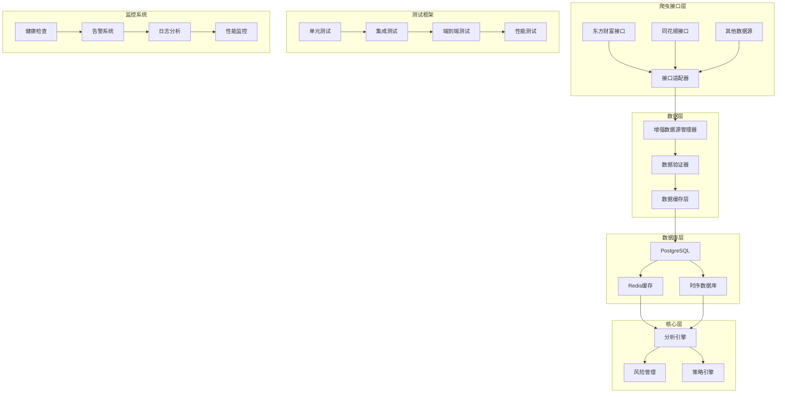
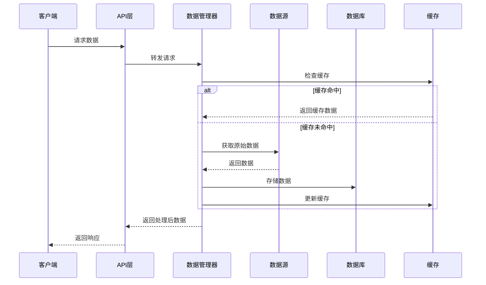

# 爬虫接口集成与全流程测试设计文档

## 概述

本设计文档详细描述了如何将 tmp/core/crawling/ 目录中的爬虫接口集成到现有股票分析系统中，并建立完整的全流程测试验证体系。设计采用模块化架构，确保系统的可扩展性、可维护性和高可用性。

## 架构设计

### 整体架构



### 数据流架构



## 组件设计

### 1. 爬虫接口适配器

#### CrawlingInterfaceAdapter
```python
class CrawlingInterfaceAdapter:
    """爬虫接口适配器，统一不同数据源的接口"""
    
    def __init__(self):
        self.adapters = {
            'eastmoney': EastMoneyAdapter(),
            'tonghuashun': TongHuaShunAdapter(),
            'sina': SinaAdapter()
        }
    
    async def get_data(self, source: str, data_type: str, params: dict) -> pd.DataFrame
    def validate_interface(self, source: str) -> bool
    def get_interface_metadata(self, source: str) -> dict
```

#### 具体适配器实现
- **EastMoneyAdapter**: 适配东方财富的股票行情、资金流向、龙虎榜等接口
- **TongHuaShunAdapter**: 适配同花顺的涨停原因、筹码竞价等接口
- **SinaAdapter**: 适配新浪财经的实时行情接口

### 2. 增强数据源管理器

#### EnhancedDataSourceManager
```python
class EnhancedDataSourceManager(DataSourceManager):
    """增强的数据源管理器"""
    
    def __init__(self):
        super().__init__()
        self.crawling_adapter = CrawlingInterfaceAdapter()
        self.data_validator = DataValidator()
        self.cache_manager = CacheManager()
        self.health_monitor = HealthMonitor()
    
    async def get_market_data(self, request: MarketDataRequest) -> pd.DataFrame
    async def get_dragon_tiger_data(self, date_range: tuple) -> pd.DataFrame
    async def get_fund_flow_data(self, symbol: str, period: str) -> pd.DataFrame
    async def get_limitup_reason_data(self, date: str) -> pd.DataFrame
    async def get_etf_data(self, symbol: str, data_type: str) -> pd.DataFrame
```

### 3. 数据验证与质量控制

#### DataValidator
```python
class DataValidator:
    """数据验证器，确保数据质量"""
    
    def validate_stock_data(self, data: pd.DataFrame) -> ValidationResult
    def validate_fund_flow_data(self, data: pd.DataFrame) -> ValidationResult
    def validate_dragon_tiger_data(self, data: pd.DataFrame) -> ValidationResult
    def check_data_completeness(self, data: pd.DataFrame) -> bool
    def detect_anomalies(self, data: pd.DataFrame) -> List[Anomaly]
```

#### 验证规则
- **数据完整性**: 检查必填字段、数据类型、数值范围
- **数据一致性**: 验证关联数据的逻辑一致性
- **数据时效性**: 检查数据的时间戳和更新频率
- **异常检测**: 识别异常值和可疑数据模式

### 4. 数据库模型扩展

#### 新增数据表结构

```sql
-- 龙虎榜数据表
CREATE TABLE dragon_tiger_board (
    id SERIAL PRIMARY KEY,
    trade_date DATE NOT NULL,
    stock_code VARCHAR(10) NOT NULL,
    stock_name VARCHAR(50) NOT NULL,
    close_price DECIMAL(10,2),
    change_rate DECIMAL(5,2),
    net_buy_amount BIGINT,
    buy_amount BIGINT,
    sell_amount BIGINT,
    reason TEXT,
    created_at TIMESTAMP DEFAULT CURRENT_TIMESTAMP,
    updated_at TIMESTAMP DEFAULT CURRENT_TIMESTAMP
);

-- 资金流向数据表
CREATE TABLE fund_flow (
    id SERIAL PRIMARY KEY,
    stock_code VARCHAR(10) NOT NULL,
    trade_date DATE NOT NULL,
    period_type VARCHAR(10) NOT NULL, -- 今日/3日/5日/10日
    main_net_inflow BIGINT,
    main_net_inflow_rate DECIMAL(5,2),
    super_large_net_inflow BIGINT,
    super_large_net_inflow_rate DECIMAL(5,2),
    large_net_inflow BIGINT,
    large_net_inflow_rate DECIMAL(5,2),
    medium_net_inflow BIGINT,
    medium_net_inflow_rate DECIMAL(5,2),
    small_net_inflow BIGINT,
    small_net_inflow_rate DECIMAL(5,2),
    created_at TIMESTAMP DEFAULT CURRENT_TIMESTAMP
);

-- 涨停原因数据表
CREATE TABLE limitup_reason (
    id SERIAL PRIMARY KEY,
    trade_date DATE NOT NULL,
    stock_code VARCHAR(10) NOT NULL,
    stock_name VARCHAR(50) NOT NULL,
    reason VARCHAR(200),
    detail_reason TEXT,
    latest_price DECIMAL(10,2),
    change_rate DECIMAL(5,2),
    change_amount DECIMAL(10,2),
    turnover_rate DECIMAL(5,2),
    volume BIGINT,
    amount BIGINT,
    dde DECIMAL(10,2),
    created_at TIMESTAMP DEFAULT CURRENT_TIMESTAMP
);

-- ETF数据表
CREATE TABLE etf_data (
    id SERIAL PRIMARY KEY,
    etf_code VARCHAR(10) NOT NULL,
    etf_name VARCHAR(50) NOT NULL,
    trade_date DATE NOT NULL,
    open_price DECIMAL(10,4),
    close_price DECIMAL(10,4),
    high_price DECIMAL(10,4),
    low_price DECIMAL(10,4),
    volume BIGINT,
    amount BIGINT,
    change_rate DECIMAL(5,2),
    turnover_rate DECIMAL(5,2),
    created_at TIMESTAMP DEFAULT CURRENT_TIMESTAMP
);
```

#### 索引设计
```sql
-- 性能优化索引
CREATE INDEX idx_dragon_tiger_date_code ON dragon_tiger_board(trade_date, stock_code);
CREATE INDEX idx_fund_flow_code_date ON fund_flow(stock_code, trade_date);
CREATE INDEX idx_limitup_date ON limitup_reason(trade_date);
CREATE INDEX idx_etf_code_date ON etf_data(etf_code, trade_date);

-- 分区表设计（按月分区）
CREATE TABLE dragon_tiger_board_y2024m01 PARTITION OF dragon_tiger_board
    FOR VALUES FROM ('2024-01-01') TO ('2024-02-01');
```

### 5. 缓存策略设计

#### CacheManager
```python
class CacheManager:
    """缓存管理器"""
    
    def __init__(self):
        self.redis_client = redis.Redis()
        self.cache_config = {
            'realtime_data': {'ttl': 60, 'key_pattern': 'rt:{symbol}'},
            'daily_data': {'ttl': 3600, 'key_pattern': 'daily:{symbol}:{date}'},
            'dragon_tiger': {'ttl': 1800, 'key_pattern': 'dt:{date}'},
            'fund_flow': {'ttl': 900, 'key_pattern': 'ff:{symbol}:{period}'}
        }
    
    async def get_cached_data(self, key: str) -> Optional[pd.DataFrame]
    async def set_cached_data(self, key: str, data: pd.DataFrame, ttl: int)
    async def invalidate_cache(self, pattern: str)
    def get_cache_stats(self) -> dict
```

## 测试策略

### 1. 单元测试设计

#### 测试覆盖范围
- **数据接口测试**: 验证每个爬虫接口的功能正确性
- **数据验证测试**: 测试数据验证规则的有效性
- **缓存机制测试**: 验证缓存的读写和失效机制
- **错误处理测试**: 测试异常情况的处理逻辑

#### 测试框架
```python
class TestCrawlingIntegration:
    """爬虫集成测试类"""
    
    def test_eastmoney_stock_data(self)
    def test_dragon_tiger_data_validation(self)
    def test_fund_flow_data_processing(self)
    def test_limitup_reason_parsing(self)
    def test_cache_mechanism(self)
    def test_error_handling(self)
```

### 2. 集成测试设计

#### 数据流测试
- **数据获取到存储**: 验证从爬虫接口到数据库的完整流程
- **数据查询优化**: 测试复杂查询的性能表现
- **并发处理**: 验证多用户同时访问的稳定性

#### 测试场景
```python
class IntegrationTestSuite:
    """集成测试套件"""
    
    async def test_data_pipeline_flow(self)
    async def test_database_integration(self)
    async def test_cache_database_sync(self)
    async def test_concurrent_data_access(self)
    async def test_failover_mechanism(self)
```

### 3. 端到端测试设计

#### 业务场景测试
- **实时行情分析**: 从数据获取到分析结果的完整流程
- **龙虎榜监控**: 龙虎榜数据的获取、分析和告警流程
- **资金流向追踪**: 资金流向数据的实时监控和趋势分析

#### 性能基准
- **数据获取延迟**: < 2秒
- **数据处理吞吐量**: > 1000条/秒
- **并发用户支持**: > 100用户
- **系统可用性**: > 99.9%

## 错误处理策略

### 1. 数据源异常处理

#### 异常类型
- **网络连接异常**: 超时、连接拒绝、DNS解析失败
- **数据格式异常**: JSON解析错误、字段缺失、数据类型错误
- **业务逻辑异常**: 数据范围异常、逻辑不一致

#### 处理策略
```python
class ErrorHandler:
    """错误处理器"""
    
    def handle_network_error(self, error: NetworkError) -> RetryStrategy
    def handle_data_format_error(self, error: DataFormatError) -> ValidationResult
    def handle_business_logic_error(self, error: BusinessError) -> ErrorResponse
    def log_error(self, error: Exception, context: dict)
```

### 2. 降级策略

#### 降级级别
1. **数据源降级**: 主数据源失效时切换到备用数据源
2. **功能降级**: 非核心功能暂停，保证核心功能正常
3. **性能降级**: 降低数据更新频率，减少系统负载

## 监控与告警

### 1. 健康检查设计

#### HealthMonitor
```python
class HealthMonitor:
    """健康监控器"""
    
    def __init__(self):
        self.check_interval = 60  # 秒
        self.alert_thresholds = {
            'response_time': 5.0,
            'error_rate': 0.05,
            'availability': 0.99
        }
    
    async def check_data_source_health(self, source: str) -> HealthStatus
    async def check_database_health(self) -> HealthStatus
    async def check_cache_health(self) -> HealthStatus
    def generate_health_report(self) -> HealthReport
```

### 2. 告警系统

#### 告警规则
- **数据源不可用**: 连续3次健康检查失败
- **响应时间过长**: 平均响应时间超过5秒
- **错误率过高**: 5分钟内错误率超过5%
- **数据质量异常**: 数据验证失败率超过1%

#### 告警通道
- **邮件告警**: 发送详细错误报告
- **短信告警**: 发送关键异常通知
- **钉钉/企微**: 发送实时告警消息
- **日志记录**: 记录所有告警事件

## 性能优化

### 1. 数据获取优化

#### 并发控制
- **连接池管理**: 复用HTTP连接，减少连接开销
- **请求限流**: 控制对外部API的请求频率
- **批量处理**: 合并多个数据请求，提高效率

#### 缓存优化
- **多级缓存**: 内存缓存 + Redis缓存 + 数据库缓存
- **预加载机制**: 预先加载热点数据
- **缓存预热**: 系统启动时预加载常用数据

### 2. 数据库优化

#### 查询优化
- **索引优化**: 根据查询模式创建合适的索引
- **分区表**: 按时间分区，提高查询效率
- **读写分离**: 读操作使用只读副本

#### 存储优化
- **数据压缩**: 使用列式存储和压缩算法
- **归档策略**: 定期归档历史数据
- **清理策略**: 自动清理过期的临时数据

## 安全考虑

### 1. 数据安全

#### 访问控制
- **API密钥管理**: 安全存储和轮换API密钥
- **权限控制**: 基于角色的数据访问控制
- **数据脱敏**: 敏感数据的脱敏处理

#### 数据传输安全
- **HTTPS加密**: 所有外部API调用使用HTTPS
- **数据签名**: 关键数据传输时进行数字签名
- **防重放攻击**: 使用时间戳和随机数防止重放

### 2. 系统安全

#### 输入验证
- **参数验证**: 严格验证所有输入参数
- **SQL注入防护**: 使用参数化查询
- **XSS防护**: 对输出数据进行转义

## 部署策略

### 1. 容器化部署

#### Docker配置
```dockerfile
FROM python:3.9-slim

WORKDIR /app
COPY requirements.txt .
RUN pip install -r requirements.txt

COPY . .
EXPOSE 8000

CMD ["python", "start_server.py"]
```

#### Kubernetes配置
```yaml
apiVersion: apps/v1
kind: Deployment
metadata:
  name: crawling-integration
spec:
  replicas: 3
  selector:
    matchLabels:
      app: crawling-integration
  template:
    metadata:
      labels:
        app: crawling-integration
    spec:
      containers:
      - name: app
        image: crawling-integration:latest
        ports:
        - containerPort: 8000
        env:
        - name: DATABASE_URL
          valueFrom:
            secretKeyRef:
              name: db-secret
              key: url
```

### 2. 监控部署

#### Prometheus配置
```yaml
global:
  scrape_interval: 15s

scrape_configs:
  - job_name: 'crawling-integration'
    static_configs:
      - targets: ['localhost:8000']
    metrics_path: '/metrics'
    scrape_interval: 30s
```

#### Grafana仪表板
- **数据源健康状态**: 实时显示各数据源的可用性
- **性能指标**: 响应时间、吞吐量、错误率
- **业务指标**: 数据获取量、处理成功率、缓存命中率

这个设计文档提供了完整的技术架构和实现方案，确保爬虫接口的有效集成和系统的稳定运行。