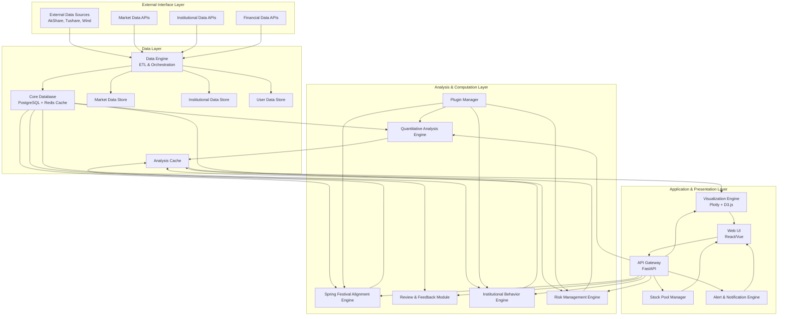

# Design Document

## Overview

The Stock Analysis System is designed as a modular, high-performance platform that combines traditional technical analysis with innovative calendar-based temporal analysis and institutional fund tracking. The system architecture follows a four-layer design pattern optimized for scalability, maintainability, and real-time performance.

The core innovation lies in the "Spring Festival Alignment Engine" which normalizes historical stock data using Chinese New Year as temporal anchor points, revealing seasonal patterns invisible to conventional analysis methods. This is integrated with comprehensive institutional fund tracking and dynamic risk management to create a complete investment decision support system.

## Architecture

### System Architecture Overview

The system follows a layered architecture with clear separation of concerns:



### Technology Stack

**Backend:**
- **Framework:** FastAPI (Python) for high-performance async API
- **Database:** PostgreSQL for relational data, Redis for caching and real-time data
- **Data Processing:** Pandas, NumPy for numerical computation
- **Scheduling:** APScheduler for automated tasks
- **Message Queue:** Celery with Redis for background processing

**Frontend:**
- **Framework:** React with TypeScript for type safety
- **Visualization:** Plotly.js for interactive charts, D3.js for custom visualizations
- **State Management:** Redux Toolkit for complex state management
- **UI Components:** Ant Design or Material-UI for consistent interface

**Infrastructure:**
- **Containerization:** Docker for deployment consistency
- **Monitoring:** Prometheus + Grafana for system monitoring
- **Logging:** Structured logging with ELK stack
- **CI/CD:** GitHub Actions for automated testing and deployment

## Components and Interfaces

### 1. Data Layer Components

#### Data Engine (B)
**Purpose:** Centralized data acquisition, cleaning, and storage orchestration

**Key Interfaces:**
```python
class DataEngine:
    def fetch_market_data(self, symbols: List[str], start_date: date, end_date: date) -> DataFrame
    def fetch_institutional_data(self, data_type: str, date_range: DateRange) -> DataFrame
    def clean_and_validate(self, raw_data: DataFrame) -> DataFrame
    def store_data(self, data: DataFrame, table_name: str) -> bool
    def schedule_daily_update(self) -> None
```

**Data Sources Integration:**
- AkShare API for A-share market data
- Tushare Pro for institutional and financial data
- Custom scrapers for dragon-tiger list data
- Real-time market data feeds for intraday monitoring

#### Core Database (C)
**Schema Design:**

```sql
-- Market Data Tables
CREATE TABLE stock_daily_data (
    id SERIAL PRIMARY KEY,
    stock_code VARCHAR(10) NOT NULL,
    trade_date DATE NOT NULL,
    open_price DECIMAL(10,3),
    high_price DECIMAL(10,3),
    low_price DECIMAL(10,3),
    close_price DECIMAL(10,3),
    volume BIGINT,
    amount DECIMAL(15,2),
    adj_factor DECIMAL(10,6),
    created_at TIMESTAMP DEFAULT NOW(),
    UNIQUE(stock_code, trade_date)
);

-- Institutional Data Tables
CREATE TABLE dragon_tiger_list (
    id SERIAL PRIMARY KEY,
    stock_code VARCHAR(10) NOT NULL,
    trade_date DATE NOT NULL,
    seat_name VARCHAR(200),
    buy_amount DECIMAL(15,2),
    sell_amount DECIMAL(15,2),
    net_amount DECIMAL(15,2),
    seat_type VARCHAR(50)
);

-- Spring Festival Analysis Cache
CREATE TABLE spring_festival_analysis (
    id SERIAL PRIMARY KEY,
    stock_code VARCHAR(10) NOT NULL,
    analysis_year INTEGER,
    spring_festival_date DATE,
    normalized_data JSONB,
    pattern_score DECIMAL(5,2),
    created_at TIMESTAMP DEFAULT NOW()
);
```

### 2. Analysis & Computation Layer Components

#### Spring Festival Alignment Engine (E)
**Purpose:** Core temporal analysis engine implementing calendar-based pattern recognition

**Algorithm Design:**
```python
class SpringFestivalAlignmentEngine:
    def __init__(self):
        self.chinese_calendar = ChineseCalendar()
        self.pattern_analyzer = PatternAnalyzer()
    
    def align_to_spring_festival(self, stock_data: DataFrame, years: List[int]) -> AlignedData:
        """
        1. Identify Spring Festival dates for each year
        2. Extract data windows (configurable, default ±60 days)
        3. Normalize prices to Spring Festival baseline
        4. Calculate relative performance metrics
        5. Identify recurring patterns and anomalies
        """
        aligned_series = []
        for year in years:
            sf_date = self.chinese_calendar.get_spring_festival(year)
            window_data = self._extract_window(stock_data, sf_date, days=60)
            normalized_data = self._normalize_to_baseline(window_data, sf_date)
            aligned_series.append(normalized_data)
        
        return self._merge_aligned_series(aligned_series)
    
    def identify_seasonal_patterns(self, aligned_data: AlignedData) -> SeasonalPatterns:
        """
        Statistical analysis to identify:
        - Recurring high/low periods
        - Volatility patterns
        - Trend strength variations
        - Risk/opportunity windows
        """
        pass
```

#### Institutional Behavior Engine (K)
**Purpose:** Analyze and categorize institutional fund movements

**Classification System:**
```python
class InstitutionalBehaviorEngine:
    def __init__(self):
        self.fund_classifier = FundClassifier()
        self.pattern_detector = InstitutionalPatternDetector()
    
    def analyze_institutional_activity(self, stock_code: str) -> InstitutionalAnalysis:
        """
        Comprehensive institutional analysis including:
        1. Fund type classification (mutual funds, social security, QFII, hot money)
        2. Activity pattern recognition (accumulation, distribution, rotation)
        3. Timing analysis (entry/exit patterns)
        4. Strength scoring (position size, persistence, coordination)
        """
        
        # Gather multi-source institutional data
        shareholder_data = self._get_shareholder_changes(stock_code)
        dragon_tiger_data = self._get_dragon_tiger_activity(stock_code)
        block_trade_data = self._get_block_trades(stock_code)
        
        # Classify and score institutional behavior
        behavior_score = self._calculate_behavior_score(
            shareholder_data, dragon_tiger_data, block_trade_data
        )
        
        return InstitutionalAnalysis(
            score=behavior_score,
            primary_actors=self._identify_key_players(shareholder_data),
            activity_timeline=self._create_activity_timeline(dragon_tiger_data),
            risk_assessment=self._assess_institutional_risk(behavior_score)
        )
```

#### Risk Management Engine (L)
**Purpose:** Dynamic risk assessment and monitoring

**Risk Calculation Framework:**
```python
class RiskManagementEngine:
    def calculate_var(self, stock_data: DataFrame, confidence_level: float = 0.95) -> VaRResult:
        """
        Calculate Value at Risk using:
        1. Historical simulation method
        2. Parametric approach (normal distribution)
        3. Monte Carlo simulation for complex scenarios
        """
        returns = stock_data['close'].pct_change().dropna()
        
        # Historical VaR
        historical_var = np.percentile(returns, (1 - confidence_level) * 100)
        
        # Parametric VaR
        mean_return = returns.mean()
        std_return = returns.std()
        parametric_var = norm.ppf(1 - confidence_level, mean_return, std_return)
        
        return VaRResult(
            historical_var=historical_var,
            parametric_var=parametric_var,
            confidence_level=confidence_level,
            holding_period=1  # daily
        )
    
    def dynamic_stop_loss(self, current_price: float, volatility: float, 
                         risk_tolerance: float) -> float:
        """
        Calculate dynamic stop-loss based on:
        - Current volatility regime
        - Seasonal risk patterns
        - Market stress indicators
        """
        base_stop = current_price * (1 - risk_tolerance)
        volatility_adjustment = volatility * 2.0  # 2-sigma adjustment
        seasonal_adjustment = self._get_seasonal_risk_adjustment()
        
        return base_stop - (volatility_adjustment + seasonal_adjustment)
```

### 3. Application & Presentation Layer Components

#### Visualization Engine (H)
**Purpose:** Generate interactive charts and visual analytics

**Chart Types and Features:**
```python
class VisualizationEngine:
    def create_spring_festival_overlay(self, stock_code: str, years: List[int]) -> PlotlyChart:
        """
        Create the signature Spring Festival alignment overlay chart:
        1. Multiple year overlay with different colors
        2. Interactive time axis with zoom/pan
        3. Hover tooltips with detailed information
        4. Clickable legend for year filtering
        5. Annotation support for marking key events
        """
        
    def create_institutional_timeline(self, institutional_data: InstitutionalData) -> D3Chart:
        """
        Timeline visualization showing:
        - Institutional entry/exit points
        - Position size changes
        - Coordination patterns between institutions
        """
        
    def create_risk_dashboard(self, risk_metrics: RiskMetrics) -> DashboardLayout:
        """
        Comprehensive risk visualization:
        - VaR gauge charts
        - Volatility trend lines
        - Risk-adjusted return scatter plots
        - Drawdown analysis charts
        """
```

#### Stock Pool Manager (I)
**Purpose:** Organize and manage stock collections

**Pool Management System:**
```python
class StockPoolManager:
    def __init__(self):
        self.pools = {}
        self.pool_metadata = {}
    
    def create_pool(self, name: str, description: str, pool_type: PoolType) -> StockPool:
        """
        Create named stock pools with metadata:
        - Watchlist pools for monitoring
        - Analysis pools for detailed study
        - Trading pools for active positions
        """
        
    def add_stocks_from_screening(self, pool_name: str, screening_results: List[str]) -> bool:
        """
        Direct integration with screening engine results
        """
        
    def get_pool_analytics(self, pool_name: str) -> PoolAnalytics:
        """
        Aggregate analytics for pool performance:
        - Average return metrics
        - Risk distribution
        - Sector/industry breakdown
        - Institutional activity summary
        """
```

## Data Models

### Core Data Structures

```python
from dataclasses import dataclass
from typing import List, Dict, Optional
from datetime import date, datetime
from enum import Enum

@dataclass
class StockData:
    stock_code: str
    trade_date: date
    open_price: float
    high_price: float
    low_price: float
    close_price: float
    volume: int
    amount: float
    adj_factor: float

@dataclass
class SpringFestivalAlignment:
    stock_code: str
    year: int
    spring_festival_date: date
    normalized_prices: List[float]
    relative_dates: List[int]  # Days relative to Spring Festival
    pattern_score: float
    volatility_profile: Dict[str, float]

@dataclass
class InstitutionalActivity:
    stock_code: str
    institution_name: str
    institution_type: InstitutionType
    activity_date: date
    activity_type: ActivityType  # NEW_ENTRY, INCREASE, DECREASE, EXIT
    position_change: float
    total_position: Optional[float]
    confidence_score: float

class InstitutionType(Enum):
    MUTUAL_FUND = "mutual_fund"
    SOCIAL_SECURITY = "social_security"
    QFII = "qfii"
    HOT_MONEY = "hot_money"
    INSURANCE = "insurance"
    PRIVATE_FUND = "private_fund"

class ActivityType(Enum):
    NEW_ENTRY = "new_entry"
    POSITION_INCREASE = "increase"
    POSITION_DECREASE = "decrease"
    COMPLETE_EXIT = "exit"

@dataclass
class RiskMetrics:
    stock_code: str
    calculation_date: date
    var_1d_95: float  # 1-day VaR at 95% confidence
    var_1d_99: float  # 1-day VaR at 99% confidence
    historical_volatility: float
    beta: float
    max_drawdown: float
    sharpe_ratio: float
    seasonal_risk_score: float

@dataclass
class ScreeningCriteria:
    technical_filters: Dict[str, any]
    seasonal_filters: Dict[str, any]
    institutional_filters: Dict[str, any]
    risk_filters: Dict[str, any]
    custom_filters: List[str]

@dataclass
class AlertRule:
    rule_id: str
    stock_code: str
    condition_type: AlertType
    condition_parameters: Dict[str, any]
    notification_channels: List[str]
    is_active: bool
    created_at: datetime
    last_triggered: Optional[datetime]
```

## Error Handling

### Error Classification and Response Strategy

**Data Quality Errors:**
- Missing market data: Implement forward-fill with validation
- Corrupted institutional data: Flag for manual review, use cached data
- API rate limiting: Implement exponential backoff with circuit breaker

**Calculation Errors:**
- Insufficient historical data: Graceful degradation with warnings
- Division by zero in risk calculations: Return NaN with appropriate flags
- Memory overflow in large dataset processing: Implement chunked processing

**System Errors:**
- Database connection failures: Automatic retry with fallback to read replicas
- Cache misses: Transparent fallback to database with cache warming
- External API failures: Use cached data with staleness indicators

```python
class SystemErrorHandler:
    def __init__(self):
        self.circuit_breaker = CircuitBreaker()
        self.retry_policy = RetryPolicy(max_attempts=3, backoff_factor=2)
    
    def handle_data_error(self, error: DataError) -> ErrorResponse:
        if error.error_type == DataErrorType.MISSING_DATA:
            return self._handle_missing_data(error)
        elif error.error_type == DataErrorType.CORRUPTED_DATA:
            return self._handle_corrupted_data(error)
        else:
            return self._handle_unknown_data_error(error)
    
    def handle_calculation_error(self, error: CalculationError) -> ErrorResponse:
        # Log error details for debugging
        logger.error(f"Calculation error: {error}")
        
        # Return graceful degradation response
        return ErrorResponse(
            success=False,
            error_message="Calculation temporarily unavailable",
            fallback_data=self._get_fallback_calculation(error.context),
            retry_after=300  # 5 minutes
        )
```

## Testing Strategy

### Unit Testing
- **Coverage Target:** 90%+ for core analysis engines
- **Mock Strategy:** Mock external APIs and database connections
- **Test Data:** Synthetic datasets with known patterns for validation

### Integration Testing
- **Database Integration:** Test with containerized PostgreSQL and Redis
- **API Integration:** Test external data source connections with rate limiting
- **End-to-End Workflows:** Complete user journey testing from screening to alerts

### Performance Testing
- **Load Testing:** Simulate concurrent users accessing visualization engine
- **Stress Testing:** Test system behavior under high data volume scenarios
- **Cache Performance:** Validate Redis cache hit rates and response times

### Data Quality Testing
- **Data Validation:** Automated checks for data completeness and accuracy
- **Pattern Recognition Validation:** Backtesting against known historical patterns
- **Risk Model Validation:** Compare VaR predictions with actual outcomes

```python
class TestSuite:
    def test_spring_festival_alignment(self):
        """Test Spring Festival alignment algorithm with known data"""
        test_data = self._load_test_stock_data()
        engine = SpringFestivalAlignmentEngine()
        result = engine.align_to_spring_festival(test_data, [2020, 2021, 2022])
        
        # Validate alignment accuracy
        assert len(result.aligned_series) == 3
        assert all(series.baseline_date.month in [1, 2] for series in result.aligned_series)
        
    def test_institutional_behavior_scoring(self):
        """Test institutional behavior analysis accuracy"""
        mock_data = self._create_mock_institutional_data()
        engine = InstitutionalBehaviorEngine()
        result = engine.analyze_institutional_activity("000001")
        
        # Validate scoring logic
        assert 0 <= result.score <= 100
        assert result.primary_actors is not None
        
    def test_risk_calculation_accuracy(self):
        """Test VaR calculation against known benchmarks"""
        test_returns = self._generate_test_returns()
        engine = RiskManagementEngine()
        var_result = engine.calculate_var(test_returns, confidence_level=0.95)
        
        # Validate VaR calculations
        assert var_result.historical_var < 0  # VaR should be negative
        assert abs(var_result.historical_var - var_result.parametric_var) < 0.05
```

This comprehensive design provides a solid foundation for implementing the stock analysis system with all the required features while maintaining scalability, performance, and reliability.