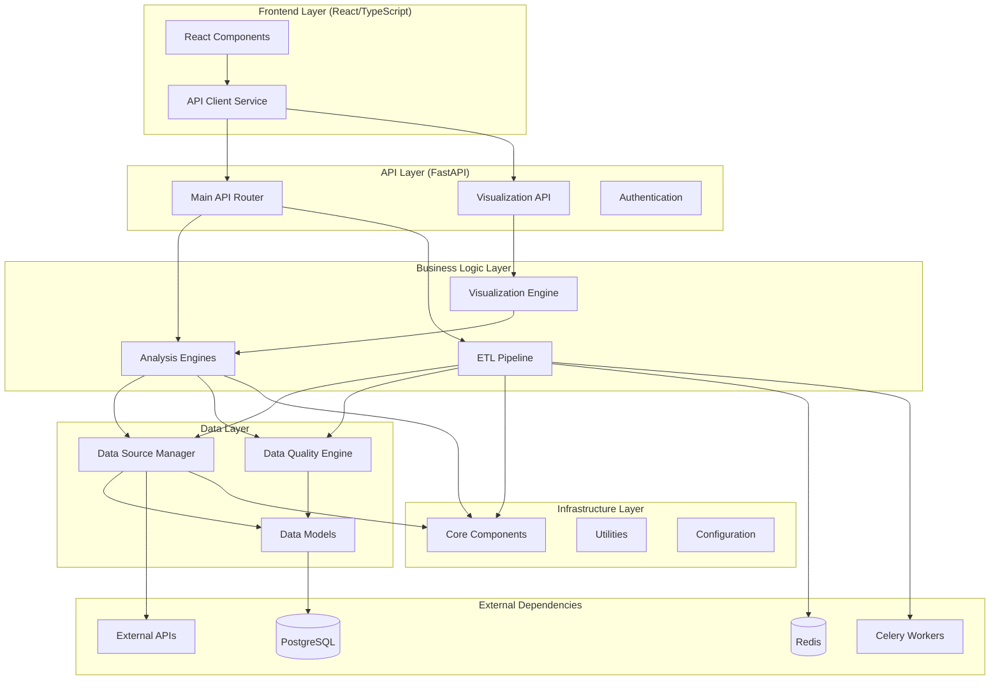
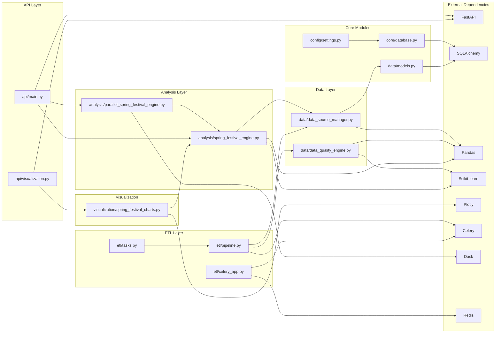
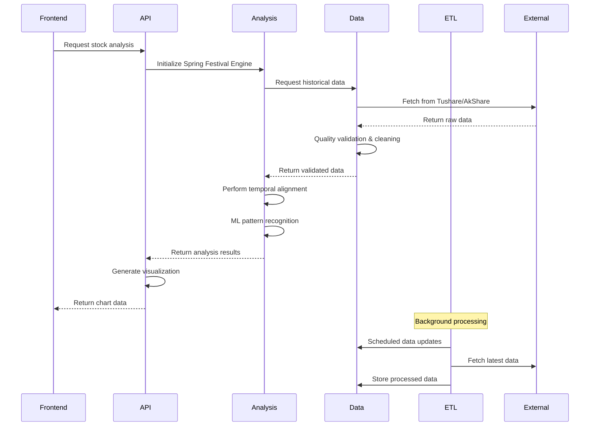
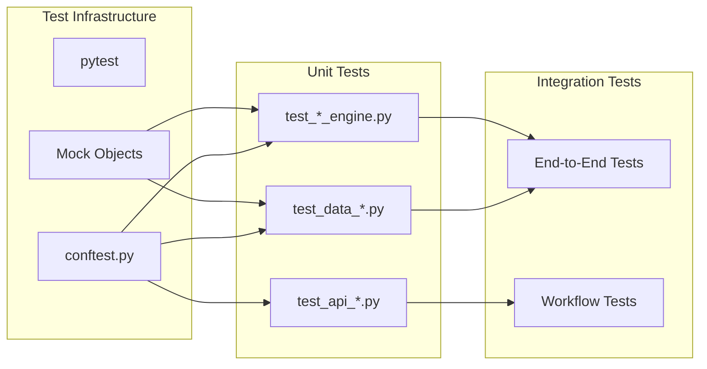
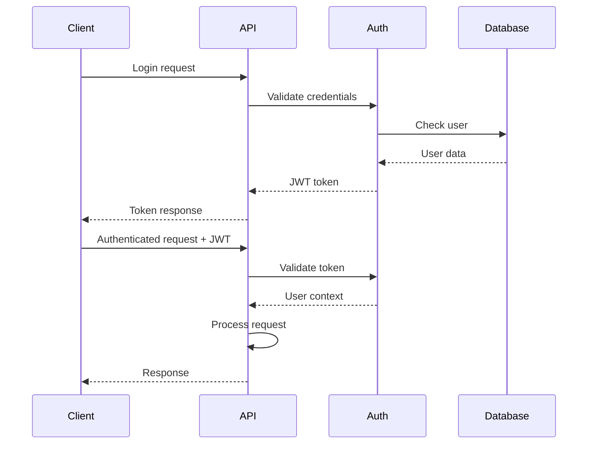

# Stock Analysis System - Code Architecture & Module Dependencies

## 📋 Overview

This document provides a comprehensive overview of the Stock Analysis System's code architecture, module organization, and inter-module dependencies. The system follows a layered architecture pattern with clear separation of concerns and modular design principles.

## 🏗️ High-Level Architecture



## 📁 Directory Structure & Module Organization

### Root Level Structure
```
stock-analysis-system/
├── stock_analysis_system/          # Main Python package
├── frontend/                       # React frontend application
├── tests/                         # Test suite
├── config/                        # Configuration files
├── scripts/                       # Utility scripts
├── docs/                          # Documentation
├── alembic/                       # Database migrations
└── data/                          # Data storage (development)
```

### Backend Module Structure
```
stock_analysis_system/
├── __init__.py                    # Package initialization
├── core/                          # Core system components
│   ├── __init__.py
│   └── database.py               # Database connection & session management
├── data/                          # Data layer components
│   ├── __init__.py
│   ├── models.py                 # SQLAlchemy data models
│   ├── data_source_manager.py    # Multi-source data acquisition
│   └── data_quality_engine.py    # ML-based data validation
├── analysis/                      # Analysis engines
│   ├── __init__.py
│   ├── spring_festival_engine.py # Core temporal analysis engine
│   └── parallel_spring_festival_engine.py # Dask-powered parallel processing
├── etl/                          # ETL pipeline components
│   ├── __init__.py
│   ├── pipeline.py               # Main ETL orchestration
│   ├── tasks.py                  # Celery background tasks
│   └── celery_app.py            # Celery application configuration
├── api/                          # API layer
│   ├── __init__.py
│   ├── main.py                   # FastAPI application & main routes
│   └── visualization.py         # Visualization API endpoints
├── visualization/                # Chart generation & visualization
│   ├── __init__.py
│   └── spring_festival_charts.py # Plotly-based chart engine
└── utils/                        # Utility functions
    └── __init__.py
```

### Frontend Module Structure
```
frontend/
├── public/                       # Static assets
├── src/
│   ├── components/              # React components
│   │   ├── Header.tsx           # Navigation header
│   │   ├── MainContent.tsx      # Main layout container
│   │   ├── StockSearch.tsx      # Stock search interface
│   │   ├── ChartControls.tsx    # Chart configuration controls
│   │   └── SpringFestivalChart.tsx # Chart display component
│   ├── services/               # API integration
│   │   └── api.ts              # HTTP client & API interfaces
│   ├── App.tsx                 # Root application component
│   └── index.tsx               # Application entry point
├── package.json                # Dependencies & scripts
└── tsconfig.json              # TypeScript configuration
```

## 🔗 Module Dependencies & Relationships

### 1. Core Dependencies Graph



### 2. Data Flow Architecture



## 📦 Module Detailed Descriptions

### 1. Core Module (`stock_analysis_system/core/`)

**Purpose**: Provides fundamental system components and base classes.

**Key Components**:
- `database.py`: Database connection management, session handling, async support

**Dependencies**:
- SQLAlchemy (ORM and database toolkit)
- asyncpg (PostgreSQL async driver)
- Configuration settings

**Used By**:
- All modules requiring database access
- Data models
- API layer

### 2. Data Layer (`stock_analysis_system/data/`)

**Purpose**: Handles all data-related operations including acquisition, validation, and storage.

#### 2.1 Data Models (`models.py`)
**Responsibilities**:
- SQLAlchemy model definitions
- Database schema representation
- Relationship definitions

**Key Models**:
```python
# Core data models
StockDailyData          # Daily OHLCV data
DragonTigerList         # Institutional activity
SpringFestivalAnalysis  # Cached analysis results
InstitutionalActivity   # Fund tracking
RiskMetrics            # Risk calculations
StockPools             # User stock collections
AlertRules             # Alert configurations
UserSessions           # Session management
SystemConfig           # System settings
```

#### 2.2 Data Source Manager (`data_source_manager.py`)
**Responsibilities**:
- Multi-source data acquisition (Tushare, AkShare, local TDX)
- Circuit breaker pattern implementation
- Automatic failover and health monitoring
- Rate limiting and request throttling

**Key Classes**:
```python
DataSourceManager      # Main orchestrator
CircuitBreaker         # Fault tolerance
RateLimiter           # Request throttling
DataSourceHealth      # Health monitoring
```

**Dependencies**:
- External APIs (Tushare, AkShare)
- pandas (data manipulation)
- asyncio (async operations)

#### 2.3 Data Quality Engine (`data_quality_engine.py`)
**Responsibilities**:
- ML-based anomaly detection
- Rule-based data validation
- Quality scoring and reporting
- Automatic data cleaning

**Key Classes**:
```python
EnhancedDataQualityEngine  # Main engine
DataQualityReport         # Quality assessment results
MLAnomalyDetector        # Isolation Forest implementation
```

**Dependencies**:
- scikit-learn (ML algorithms)
- pandas (data processing)
- numpy (numerical operations)

### 3. Analysis Layer (`stock_analysis_system/analysis/`)

**Purpose**: Core business logic for stock analysis and pattern recognition.

#### 3.1 Spring Festival Engine (`spring_festival_engine.py`)
**Responsibilities**:
- Chinese calendar integration
- Temporal data alignment
- Seasonal pattern recognition
- Trading signal generation

**Key Classes**:
```python
SpringFestivalAlignmentEngine  # Main analysis engine
ChineseCalendar               # Spring Festival date calculations
AlignedTimeSeries            # Temporal data structure
SeasonalPattern              # Pattern analysis results
```

**Dependencies**:
- Data Source Manager
- pandas/numpy (data processing)
- scikit-learn (ML algorithms)

#### 3.2 Parallel Spring Festival Engine (`parallel_spring_festival_engine.py`)
**Responsibilities**:
- Distributed computing with Dask
- Memory optimization
- Resource management
- Batch processing

**Key Classes**:
```python
ParallelSpringFestivalEngine  # Dask-powered engine
DaskResourceManager          # Resource optimization
ParallelProcessingConfig     # Configuration management
```

**Dependencies**:
- Spring Festival Engine (base functionality)
- Dask (distributed computing)
- Memory profiling tools

### 4. ETL Layer (`stock_analysis_system/etl/`)

**Purpose**: Extract, Transform, Load operations with background processing.

#### 4.1 ETL Pipeline (`pipeline.py`)
**Responsibilities**:
- Data ingestion orchestration
- Transformation workflows
- Quality validation integration
- Batch processing management

**Key Classes**:
```python
ETLPipeline           # Main orchestrator
ETLJobConfig         # Job configuration
ETLMetrics           # Performance tracking
```

#### 4.2 Celery Tasks (`tasks.py`)
**Responsibilities**:
- Background task definitions
- Scheduled data updates
- Error handling and retries

**Key Tasks**:
```python
daily_data_ingestion     # Daily market data updates
historical_backfill      # Historical data loading
data_quality_check       # Quality validation
generate_quality_report  # Reporting
cleanup_old_data        # Maintenance
```

#### 4.3 Celery Application (`celery_app.py`)
**Responsibilities**:
- Celery configuration
- Task routing
- Worker management

**Dependencies**:
- Celery (task queue)
- Redis (message broker)
- ETL Pipeline

### 5. API Layer (`stock_analysis_system/api/`)

**Purpose**: RESTful API endpoints and HTTP request handling.

#### 5.1 Main API (`main.py`)
**Responsibilities**:
- FastAPI application setup
- Core API endpoints
- Authentication and authorization
- Request/response handling

**Key Endpoints**:
```python
GET  /health                    # System health check
GET  /api/v1/stocks            # Stock search
GET  /api/v1/stocks/{symbol}   # Stock details
POST /api/v1/analysis          # Spring Festival analysis
```

#### 5.2 Visualization API (`visualization.py`)
**Responsibilities**:
- Chart generation endpoints
- Export functionality
- Visualization configuration

**Key Endpoints**:
```python
POST /api/v1/visualization/spring-festival-chart  # Generate charts
POST /api/v1/visualization/export                 # Export charts
GET  /api/v1/visualization/sample                 # Sample charts
```

**Dependencies**:
- FastAPI (web framework)
- Analysis engines
- Visualization engine

### 6. Visualization Layer (`stock_analysis_system/visualization/`)

**Purpose**: Chart generation and data visualization.

#### 6.1 Spring Festival Charts (`spring_festival_charts.py`)
**Responsibilities**:
- Interactive chart creation
- Multi-format export
- Chart configuration management

**Key Classes**:
```python
SpringFestivalChartEngine  # Main chart generator
SpringFestivalChartConfig  # Configuration management
```

**Dependencies**:
- Plotly (charting library)
- Analysis engines
- pandas (data processing)

## 🔄 Inter-Module Communication Patterns

### 1. Dependency Injection Pattern
```python
# Example: Analysis engine receiving data manager
class SpringFestivalAlignmentEngine:
    def __init__(self, data_manager: DataSourceManager):
        self.data_manager = data_manager
```

### 2. Factory Pattern
```python
# Example: Creating configured engines
async def get_analysis_engine() -> SpringFestivalAlignmentEngine:
    data_manager = await get_data_source_manager()
    return SpringFestivalAlignmentEngine(data_manager)
```

### 3. Observer Pattern
```python
# Example: ETL pipeline notifications
class ETLPipeline:
    def notify_completion(self, job_id: str, metrics: ETLMetrics):
        # Notify subscribers of job completion
        pass
```

### 4. Strategy Pattern
```python
# Example: Different data sources
class DataSourceManager:
    def __init__(self, sources: List[DataSource]):
        self.sources = sources  # Different strategies for data acquisition
```

## 🧪 Testing Architecture

### Test Organization
```
tests/
├── unit/                      # Unit tests for individual modules
├── integration/               # Integration tests for module interactions
├── conftest.py               # Pytest configuration and fixtures
├── test_*.py                 # Module-specific test files
└── fixtures/                 # Test data and mock objects
```

### Test Dependencies


## 📊 Performance Considerations

### 1. Caching Strategy
- **Redis**: Session data, API responses, computed results
- **In-Memory**: Configuration, frequently accessed data
- **Database**: Persistent data with proper indexing

### 2. Async Operations
- **FastAPI**: Async request handling
- **Database**: Async database operations
- **External APIs**: Non-blocking API calls

### 3. Parallel Processing
- **Dask**: Distributed computing for large datasets
- **Celery**: Background task processing
- **Multiprocessing**: CPU-intensive operations

## 🔒 Security Architecture

### 1. Authentication Flow


### 2. Data Protection
- **Input Validation**: Pydantic models for request validation
- **SQL Injection**: SQLAlchemy ORM protection
- **XSS Protection**: React built-in protection
- **HTTPS**: TLS encryption for data in transit

## 🚀 Deployment Architecture

### 1. Development Environment
```yaml
# docker-compose.yml structure
services:
  postgres:     # Database
  redis:        # Cache & message broker
  api:          # FastAPI application
  celery:       # Background workers
  frontend:     # React development server
```

### 2. Production Considerations
- **Load Balancing**: Multiple API instances
- **Database**: Connection pooling, read replicas
- **Caching**: Redis cluster for high availability
- **Monitoring**: Health checks, metrics collection

## 📈 Scalability Patterns

### 1. Horizontal Scaling
- **API Layer**: Multiple FastAPI instances behind load balancer
- **Workers**: Multiple Celery workers for background processing
- **Database**: Read replicas for query distribution

### 2. Vertical Scaling
- **Memory**: Optimized data structures and caching
- **CPU**: Parallel processing with Dask
- **Storage**: Efficient database indexing and partitioning

## 🔧 Configuration Management

### Configuration Hierarchy
```python
# config/settings.py structure
class Settings:
    # Database configuration
    database: DatabaseSettings
    
    # Redis configuration  
    redis: RedisSettings
    
    # API configuration
    api: APISettings
    
    # Data source configuration
    data_sources: DataSourceSettings
    
    # ML configuration
    ml: MLSettings
```

### Environment-Based Configuration
- **Development**: Local database, debug logging
- **Testing**: In-memory database, mock external APIs
- **Production**: Clustered database, structured logging

## 📚 Documentation Architecture

### Documentation Structure
```
docs/
├── ARCHITECTURE.md           # This document
├── API.md                   # API documentation
├── DEPLOYMENT.md            # Deployment guide
├── DEVELOPMENT.md           # Development setup
├── USER_GUIDE.md           # User documentation
└── TROUBLESHOOTING.md      # Common issues and solutions
```

## 🔮 Future Architecture Considerations

### Planned Enhancements
1. **Microservices**: Split into domain-specific services
2. **Event Sourcing**: Event-driven architecture for audit trails
3. **CQRS**: Separate read/write models for performance
4. **GraphQL**: Flexible API queries for frontend
5. **Kubernetes**: Container orchestration for production

### Technology Evolution
1. **ML Pipeline**: MLflow for model lifecycle management
2. **Real-time Processing**: Apache Kafka for streaming data
3. **Advanced Analytics**: TensorFlow/PyTorch for deep learning
4. **Monitoring**: Prometheus/Grafana for observability

## 📋 Summary

The Stock Analysis System follows a well-structured, modular architecture that promotes:

- **Separation of Concerns**: Clear boundaries between layers
- **Scalability**: Horizontal and vertical scaling capabilities
- **Maintainability**: Modular design with clear dependencies
- **Testability**: Comprehensive test coverage with proper isolation
- **Security**: Multiple layers of protection
- **Performance**: Optimized for high-throughput operations

The architecture successfully balances complexity with maintainability, providing a solid foundation for current functionality while supporting future enhancements and scaling requirements.

---

**Document Version**: 1.0  
**Last Updated**: January 2025  
**Maintained By**: Development Team