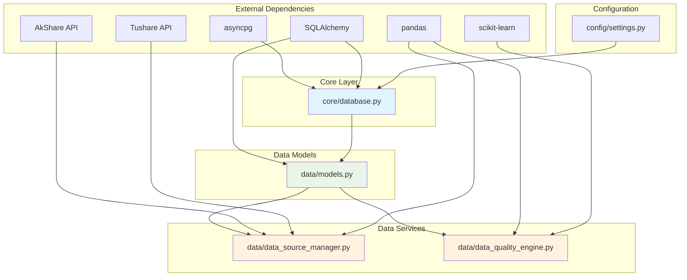
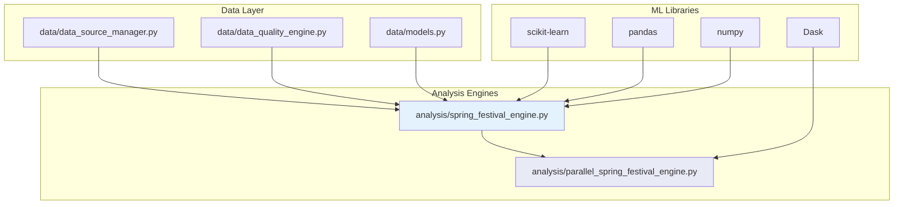
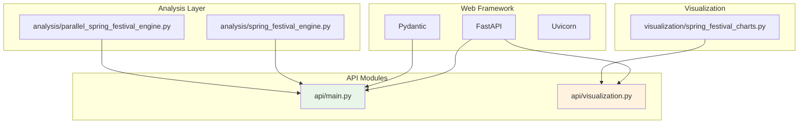
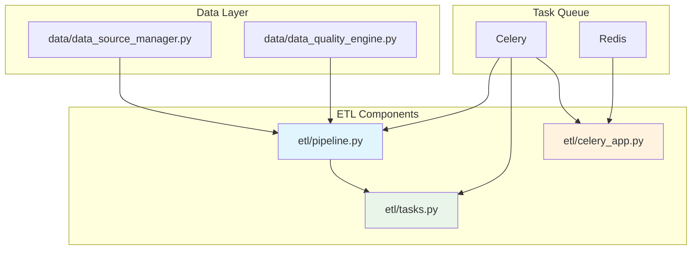
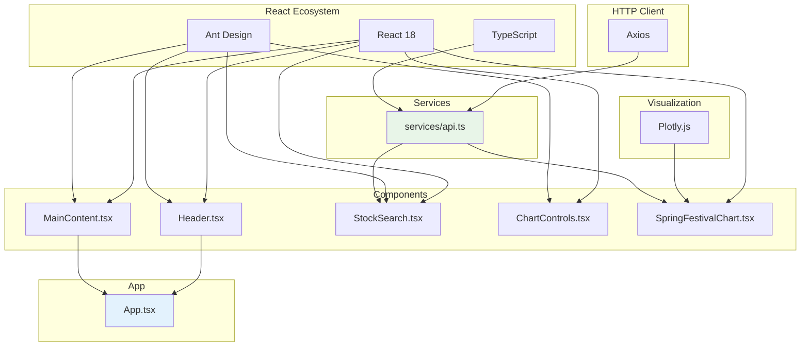
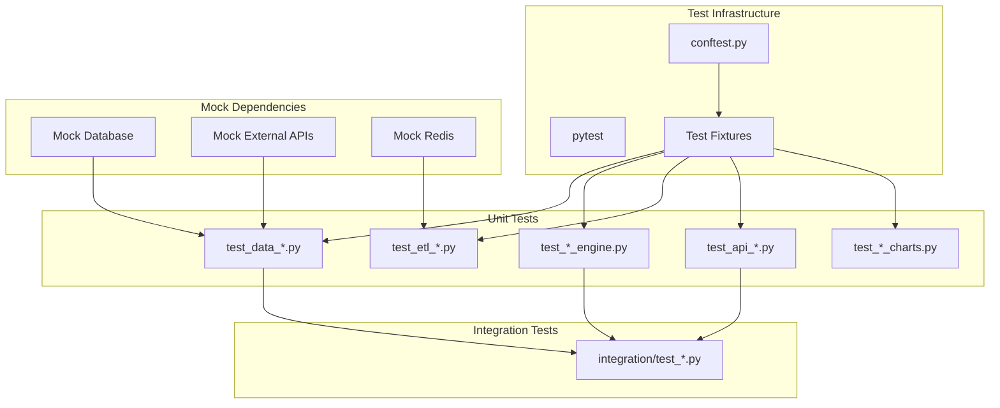

# Module Dependencies & Import Graph

## 📊 Overview

This document provides detailed dependency graphs and import relationships between modules in the Stock Analysis System. It serves as a reference for understanding module coupling and identifying potential circular dependencies.

## 🔗 Import Dependency Matrix

### Core Dependencies Table

| Module | Depends On | Used By | Coupling Level |
|--------|------------|---------|----------------|
| `core/database.py` | SQLAlchemy, asyncpg, config | All data modules | **Low** |
| `data/models.py` | SQLAlchemy, core/database | All modules using DB | **Low** |
| `data/data_source_manager.py` | pandas, asyncio, external APIs | analysis, etl | **Medium** |
| `data/data_quality_engine.py` | scikit-learn, pandas, numpy | etl, analysis | **Medium** |
| `analysis/spring_festival_engine.py` | data modules, pandas, sklearn | api, visualization | **High** |
| `analysis/parallel_spring_festival_engine.py` | spring_festival_engine, dask | api | **High** |
| `etl/pipeline.py` | data modules, celery | etl/tasks | **Medium** |
| `etl/tasks.py` | etl/pipeline, celery | celery workers | **Medium** |
| `api/main.py` | FastAPI, analysis modules | frontend | **High** |
| `api/visualization.py` | visualization modules, FastAPI | frontend | **Medium** |
| `visualization/spring_festival_charts.py` | plotly, analysis modules | api/visualization | **Medium** |

## 📈 Detailed Dependency Graphs

### 1. Data Layer Dependencies



### 2. Analysis Layer Dependencies



### 3. API Layer Dependencies



### 4. ETL Layer Dependencies



### 5. Frontend Dependencies



## 🔄 Circular Dependency Analysis

### Current Status: ✅ No Circular Dependencies

The system has been designed to avoid circular dependencies through:

1. **Layered Architecture**: Clear dependency direction from top to bottom
2. **Dependency Injection**: Interfaces and factory patterns
3. **Event-Driven Communication**: Loose coupling between components

### Potential Risk Areas

1. **Analysis ↔ Visualization**: Mitigated by one-way dependency (visualization depends on analysis)
2. **API ↔ Analysis**: Mitigated by dependency injection pattern
3. **ETL ↔ Data**: Mitigated by clear service boundaries

## 📊 Module Coupling Analysis

### Coupling Levels

#### Low Coupling (✅ Good)
- `core/database.py` - Only depends on external libraries
- `data/models.py` - Only depends on SQLAlchemy and core
- `config/settings.py` - No internal dependencies

#### Medium Coupling (⚠️ Acceptable)
- `data/data_source_manager.py` - Depends on external APIs and models
- `etl/pipeline.py` - Orchestrates multiple data services
- `visualization/spring_festival_charts.py` - Depends on analysis results

#### High Coupling (🔍 Monitor)
- `analysis/spring_festival_engine.py` - Central business logic, many dependencies
- `api/main.py` - Orchestrates multiple services
- `analysis/parallel_spring_festival_engine.py` - Extends base engine

### Coupling Reduction Strategies

1. **Interface Segregation**: Define minimal interfaces for dependencies
2. **Dependency Injection**: Use factory patterns and DI containers
3. **Event-Driven Architecture**: Reduce direct coupling through events
4. **Service Locator**: Centralized service discovery

## 🧪 Testing Dependencies

### Test Module Structure



### Test Isolation Strategy

1. **Unit Tests**: Mock all external dependencies
2. **Integration Tests**: Use test database and containers
3. **End-to-End Tests**: Full system with test data

## 📦 Package Import Patterns

### Standard Import Structure

```python
# Standard library imports
import asyncio
import logging
from datetime import date, datetime
from typing import Dict, List, Optional

# Third-party imports
import pandas as pd
import numpy as np
from fastapi import FastAPI, HTTPException
from sqlalchemy import select

# Local imports
from stock_analysis_system.core.database import get_session
from stock_analysis_system.data.models import StockDailyData
from stock_analysis_system.data.data_source_manager import DataSourceManager
```

### Import Guidelines

1. **Standard Library First**: Built-in Python modules
2. **Third-Party Second**: External packages
3. **Local Imports Last**: Internal modules
4. **Relative Imports**: Avoid when possible, use absolute imports
5. **Circular Imports**: Prevented through design

## 🔧 Dependency Management

### Requirements Structure

```
requirements.txt                 # Production dependencies
requirements-dev.txt            # Development dependencies
requirements-test.txt           # Testing dependencies
```

### Key Dependencies by Category

#### Core Framework
```
fastapi>=0.104.0               # Web framework
uvicorn>=0.24.0               # ASGI server
sqlalchemy>=2.0.0             # ORM
alembic>=1.12.0               # Database migrations
```

#### Data Processing
```
pandas>=2.0.0                 # Data manipulation
numpy>=1.24.0                 # Numerical computing
scikit-learn>=1.3.0           # Machine learning
dask>=2023.1.0                # Parallel computing
```

#### Visualization
```
plotly>=5.17.0                # Interactive charts
kaleido>=0.2.1                # Static image export
```

#### Task Queue
```
celery>=5.3.0                 # Background tasks
redis>=5.0.0                  # Message broker
```

#### Development
```
pytest>=7.4.0                # Testing framework
black>=23.0.0                 # Code formatting
mypy>=1.5.0                   # Type checking
```

## 🚀 Performance Impact of Dependencies

### Heavy Dependencies
1. **pandas**: Large memory footprint, optimize usage
2. **scikit-learn**: CPU-intensive operations, use caching
3. **plotly**: Large JavaScript bundle, lazy loading
4. **dask**: Memory overhead, configure properly

### Optimization Strategies
1. **Lazy Loading**: Import heavy modules only when needed
2. **Caching**: Cache expensive computations
3. **Memory Management**: Explicit cleanup of large objects
4. **Async Operations**: Non-blocking I/O operations

## 📈 Dependency Evolution

### Version Compatibility Matrix

| Component | Current Version | Min Version | Max Version | Notes |
|-----------|----------------|-------------|-------------|-------|
| Python | 3.12 | 3.9 | 3.12 | Type hints compatibility |
| FastAPI | 0.104+ | 0.100 | Latest | Async improvements |
| pandas | 2.0+ | 1.5 | Latest | Arrow backend support |
| SQLAlchemy | 2.0+ | 2.0 | Latest | Async ORM required |
| React | 18+ | 18.0 | Latest | Concurrent features |

### Upgrade Strategy
1. **Patch Updates**: Automatic via dependabot
2. **Minor Updates**: Monthly review and testing
3. **Major Updates**: Quarterly planning and migration
4. **Security Updates**: Immediate application

## 🔒 Security Dependencies

### Security-Critical Dependencies
1. **FastAPI**: Input validation, CORS handling
2. **SQLAlchemy**: SQL injection prevention
3. **JWT Libraries**: Token validation
4. **Cryptography**: Data encryption

### Security Monitoring
1. **Vulnerability Scanning**: Regular dependency audits
2. **License Compliance**: Open source license tracking
3. **Supply Chain Security**: Dependency provenance verification

## 📋 Summary

The Stock Analysis System maintains a well-structured dependency graph with:

- ✅ **No Circular Dependencies**: Clean layered architecture
- ✅ **Appropriate Coupling**: Balanced between flexibility and simplicity
- ✅ **Clear Boundaries**: Well-defined module responsibilities
- ✅ **Testable Design**: Proper dependency injection and mocking
- ✅ **Performance Conscious**: Optimized dependency usage
- ✅ **Security Aware**: Regular security updates and monitoring

The dependency structure supports both current functionality and future scalability while maintaining code quality and system reliability.

---

**Document Version**: 1.0  
**Last Updated**: January 2025  
**Maintained By**: Development Team